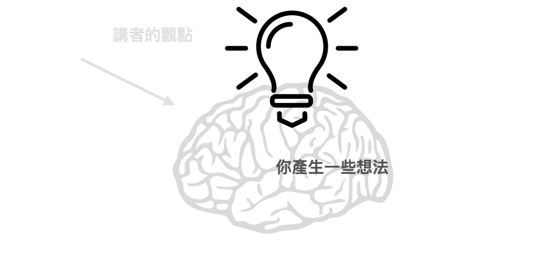
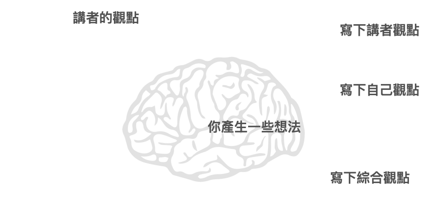
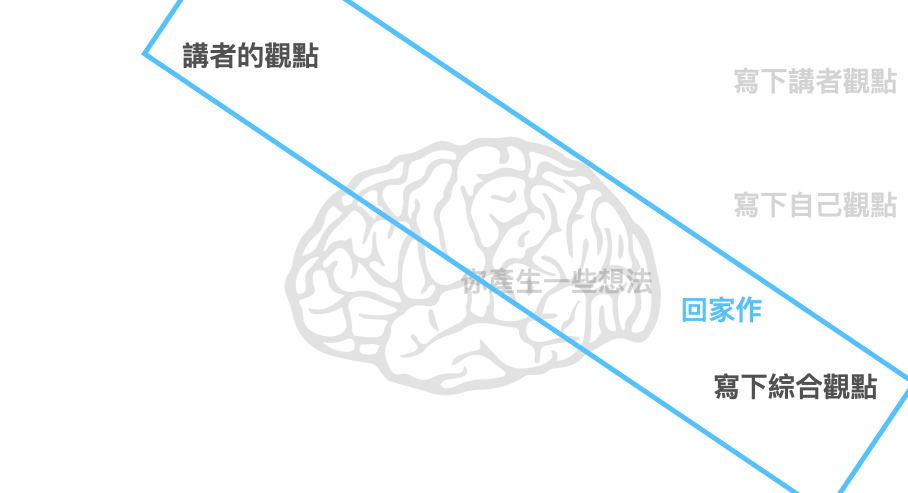
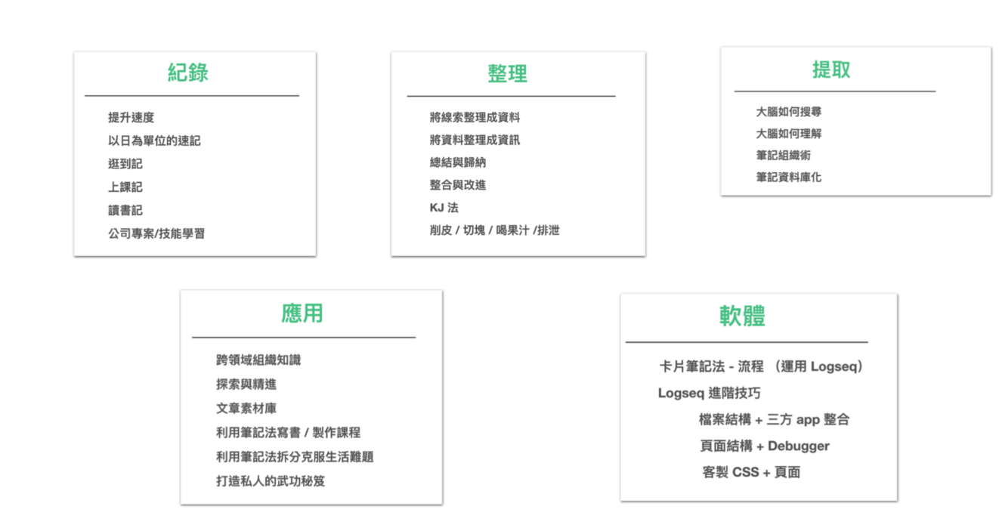

我的观点是，在解决一个问题之前，我们不应该贸然地去「改进」现有的流程。在学习的道路上，「笔记」常常是一个绊脚石。

虽然每个人都似乎会做「笔记」，但却很少有人能做好。不管是哪种流派，使用起来都很不舒服。我的工程经验告诉我，这个问题的解决方案一开始就有问题。

在我原本要开的笔记软件读书会之前，我对所有的人进行了一次问卷调查，想在弄清楚在笔记这个议题上，到底哪些地方出现了问题。

我对所有的人都进行了一次问卷调查，想厘清在笔记这个议题上，到底哪里卡关？

我对这个问卷调查的热烈回应感到惊讶。在一天之内，我收到了一百多个回应。

快速浏览这些答案后，我惊讶地发现，我开错了读书会。因为大家对这套笔记软件的使用没有疑问，他们所关心的问题是更基础的：「究竟如何做笔记」？

我意识到，笔记是我们在学习路上最常使用的工具，但我们的教育体系从来没有教过我们如何做笔记。大家都是凭借直觉在暴力地作笔记。

市面上关于笔记的书籍很多，可以说是学习书内分类之冠。但是，有哪本书真正解决了人们的问题呢？答案是：没有。

这引起了我的好奇心和研究兴趣。难道这个问题和打造超人系列的主题一样，也需要被解决吗？

## 重新梳理流程

如何破解这个问题？

那么，如何解决这个问题呢？

对于那些看似超级困难的问题，我的解决方法是一样的：采用「逆向法」，使用大数据搜集问题，进行反向分类。

之所以要这样处理，是因为在我从事工程方面的经验中，只要业界惯用的方法特别的别扭。那一定是这个问题没被好好解决过，大家都使用直觉硬堆答案，没让这个问题被好好解决过。硬堆出来的答案常常存在着「超级不合理」的流程结构。

面对这种问题，第一步就是要重新梳理问题，解开这些困局。

我将收集到的问题进行了标记后，发现在这个领域中存在着十几种、二十几种、甚至更多不同类型的困扰。

我进一步对这些问题进行了分类整理，并将它们归为五大类：

我发现原来笔记界困扰大家的真正问题，并不是单纯「如何记录」以及「如何搜寻」。

而是有五大类，围绕着：纪录、整理、搜寻、应用、软体。

* 如何快速纪录？
* 如何有效纪录？
* 如何快速整理？
* 如何有效整理？
* 如何快速搜寻？
* 如何有效搜寻？
* 如何快速应用？
* 如何有效应用？
* 要用哪些方法、工具、软体做到上述这一切？

## 将笔记这件事情流程化

此外，这五个关键词还需要重新排序，形成一个直观的流程。

以下是修改后的文章：

此外，这五个关键词还需要重新排序，形成一个直观的流程。

当你看到这张图时，可能会觉得这个流程非常合理。似乎这就是每个人在做笔记时希望达到的理想状态。然而，为什么我们仍然在日常的笔记记录和整理中遇到困难呢？

因为这并不是当今流行的笔记技巧流程。

### 现实世界的笔记术：同时纪录与整理

市面上几乎所有的笔记法，都在使用相同一个流程：

**同时纪录与整理**

这样的方法似乎合理。

但是这个方法，在后续实际使用上。特别是需要搜寻笔记内资讯时，却变得相当困难。

此外，要将多本笔记的资讯整合在一起，几乎是不可能的，需要付出极大的努力。

### 高效的笔记术：将记录与整理分开

同时纪录与整理似乎是一个很直观合理的笔记技巧。但在我对笔记学这门学问进行反思后，我发现这种方法其实非常违反人类大脑的运作原理。

接下来，让我来慢慢解析一下人类大脑在上课时的思维过程，希望能帮助你理解这个问题。

首先，在上课时，人类接收到许多讲者的观点。

接着，针对这些观点，你会产生很多的想法:

这时候，大脑的小剧场就来了。

首先，在上课时，人类会接收到许多讲者的观点。接着，你会对这些观点产生许多想法。

此时，大脑的小剧场就开始运作了。

在脑海中，无数想法瞬间浮现。接收到外界信息后，我们到底应该写下讲者的观点，还是自己的观点，或者是综合观点呢？

这也通常是我们在做笔记时容易当机的地方。

### 按下暂停键，平移时间轴

那么，我们又要怎样解开这种当机局面呢？

一个简单的方法是，将这些问题分开处理，不要同时处理，一个一个各个击破。

比如，现在科技很发达，所以我是这样做的：

在「记录讲者观点」这个动作上，我通常是使用录音机、录影机、相机去记录资讯。这样我就不会有「来不及抄」或「纪录的不仔细」的问题。

然后在"写下自己的观点"时，我就有足够的时间来思考。

当然，仅凭前两者是不够的。

若要充分吸收，我还会在时限内（大脑记忆的保鲜期限通常是回家当天、当周末、两周内）花时间，将前两份资料整理，并进行有效吸收，写下自己的"综合观点"。经过反复的整理，逐步建立成自己的私有领域百科，让不断增添的笔记、过去自己研究的 SOP、洞见，可以彼此串连。将来在需要时，很快的随时搜寻出来，实战应用。

这听起来好像很合理，但是又像是天方夜谭似的复杂费工。

这听起来好像很合理，但又像是天方夜谭般复杂费力。然而，请相信我，这件事情真的可行。不仅如此，其实流程比各位读者想象的要简单得多。

在之前的读书会上，很多成员在使用了这个新流程后，只用了一天就学会了，三天之内就成瘾变成了笔记狂魔，同时成功建立了自己的领域宝库。

我出版这本书的原因之一，是因为这个议题困扰了太多人，而且「合理」的流程实际上非常简单而且高效率。我们没有理由不分享出来，造福更多人。

### 解開整理無窮迴圈，記出有效又有用的筆記

我们在本节前段，稍微点出了笔记的第一个关键问题：

> 放弃同时「纪录」与「整理」

接下来，我们更会进一步解析

* 纪录
* 整理
* 搜寻
* 应用
* 软体

后面的每一个流程步骤，击破误区，让大家变得更高效！

几日之内，你也可以变成笔记高手。

