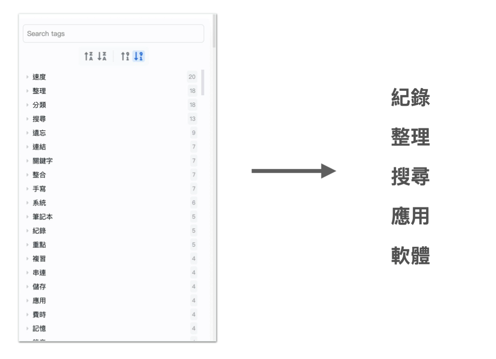
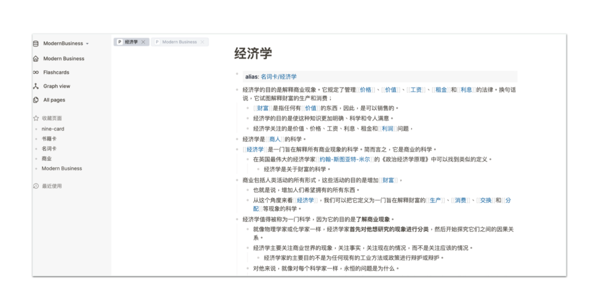

我的观点是，在解决一个问题之前，我们不应该贸然的就去「改进」现有的流程。

「笔记」是在学习路上，必会「踢到」的绊脚石之一。

人人都似乎会做「笔记」，但人人都做不好「笔记」

不管现有哪家流派，多半用起来都让人很不舒服。在我过去工程的经验直觉让我惊觉：是不是这件事的解法，一开始就有问题呢？

在那次本来要开的笔记软体读书会之前。

我对所有的人都进行了一次问卷调查，想厘清在笔记这个议题上，到底哪里卡关？

回应之热烈让我大吃一惊。冈市一天之内我收到了一百多个回应。

快速浏览过这些答案后，我赫然发现，我开错读书会了。因为大家对这套笔记软体使用上没有疑问。大家有疑问的，是更基础的：「究竟如何做笔记」？

无意中，我发现了，是秘密又不是秘密的惊天大秘密：笔记是我们在学习路上最常使用的工具，但我们过去教育从来没有人教过我们如何做笔记。大家都是凭直觉在暴力作笔记。

坊间关于笔记这个的书籍之多，可谓学习书内分类之冠。

但有真正解决过大众的问题吗？----没有。

这引起了我的研究与好奇之心。

是不是这个问题跟打造超人系列的主题一样，也需要被破解呢？

## 重新梳理流程

如何破解这个问题？

我对于那种宇宙超级困难的问题，都是用同样一套方法「逆向法」下去求解。使用大数据、搜集问题，反向分类。

之所以要这样处理的原因，是过去在我工程方面的经验中，是只要业界惯用的方法特别的别扭。那一定是这个问题没被好好解决过，直觉硬堆出来的答案，存在着「超级不合理」的流程结构。

面对这种问题，第一步要做的就是解开这些死结，再重新梳理。

我把收集到的这个问题，打上标签后，发现这个领域中存在这十几二几十几种类型不同的困扰。

再次将这些小分类，再次整理，最后被归为五大类：

我发现原来笔记界困扰大家的真正问题，并不是单纯「如何记录」以及「如何搜寻」。

而是有五大类，围绕着：纪录、整理、搜寻、应用、软体。

* 如何快速纪录？
* 如何有效纪录？
* 如何快速整理？
* 如何有效整理？
* 如何快速搜寻？
* 如何有效搜寻？
* 如何快速应用？
* 如何有效应用？
* 要用哪些方法、工具、软体做到上述这一切？

## 将笔记这件事情流程化

而且，这五个关键字还需要被重新排序：

变成一个直观的流程。

当然，乍一看到这张图，各位读者会觉得十分合理。彷佛做笔记的流程就该是这样。而且是每个人在做笔记时就希望达到的境界。

但是为什么我们还是在日常笔记纪录、整理上踢到铁板呢？

因为这真的不是当今笔记术的流程。

### 现实世界的笔记术：同时纪录与整理

市面上几乎所有的笔记法，都在使用相同一个流程：

**同时纪录与整理**

这样的方法似乎合理。

但是这个方法，在后续实际使用上。特别是需要搜寻笔记内资讯时，却变得相当困难。

同时，若要将多本笔记的资讯整合在一起，也会是费工到几乎不可能的状态。

### 高效的笔记术：将记录与整理分开

同时纪录与整理，似乎是笔记学这门学问上很直观合理的作法。

不检讨笔记这门学问我还没发现。

同时纪录与整理，这个动作其实是非常违反人类的大脑运作的原理。

怎么说呢？

让我将上课时的人类大脑思绪慢动作解析分镜，各位读者就会理解了。

大脑是这样运作的：

首先，在上课时，人类接收到许多讲者的观点。

接着，针对这些观点，你会产生很多的想法:

这时候，大脑的小剧场就来了。

此时，在脑内无数想法会立刻浮现。

接收到外界讯息后，我们到底是要：

* 写下讲者观点？
* 写下自己观点？
* 写下综合观点？

这也通常是我们在做笔记时，通常会当机的部分。

### 按下暂停键，平移时间轴

那么，我们又要怎样解开这种当机局面呢？

一个简单作法是，将这些议题分开。不要同时处理，一个一个各个击破。

比如，现在科技很发达，所以我是这样做的：

在「记录讲者观点」这个动作上，我通常是使用录音机、录影机、相机去记录资讯。这样我就不会有「来不及抄」或「纪录的不仔细」的问题。

而后在「写下自己观点时」，我就有足够充裕的时间。

当然，只有前两者是不够的。

若要充分吸收，我还会在时限内（大脑记忆的保鲜期限通常是回家当天，当周末，两周内）花时间，将前两份资料，整理「写下综合观点」，进行有效的吸收。

经过反覆的整理后，逐步建设成自己的私有领域百科。让不断增添的
笔记与过去自己研究的 SOP 、洞见，可以彼此串连。将来在需要时，很快的随时搜寻出来，实战应用。

这听起来好像很合理，但是又像是天方夜谭似的复杂费工。

不过，因为这本书是打造超人系列。请各位相信我，这件事情真的做得到。而且不但做得到，流程还远比各位读者想象的要简单的很多。

当初很多读书会成员，在用过这个新流程后，一天就学上手，三天立即就成瘾变成了笔记狂魔，自己也顺利建立起自己的领域宝库。

我之所以出版这本书，这个议题实在是困扰太多人了，而且「合理」的流程其实超简单又高效率。没有理由不分享出来造福更多人。

### 解開整理無窮迴圈，記出有效又有用的筆記

我们在本节前段，稍微点出了笔记的第一个关键问题：

> 放弃同时「纪录」与「整理」

接下来，我们更会进一步解析

* 纪录
* 整理
* 搜寻
* 应用
* 软体

后面的每一个流程步骤，击破误区，让大家变得更高效！

几日之内，你也可以变成笔记高手。

