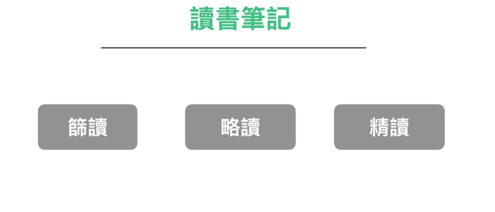
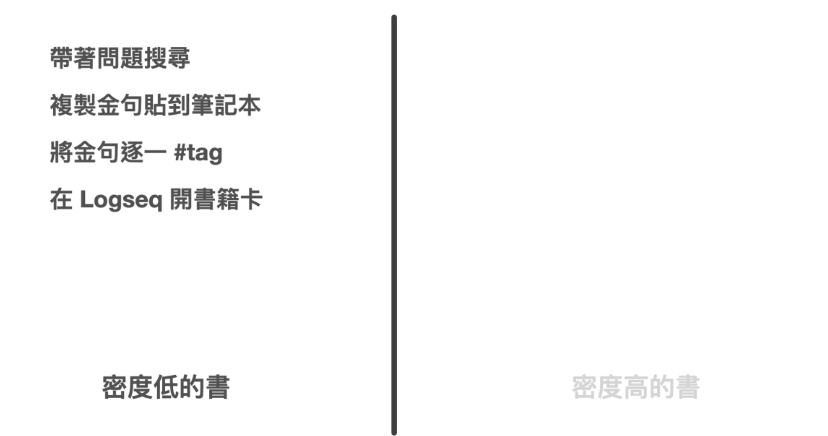

这一节我们将讨论读书笔记。这是许多人感到棘手的场景之一。

究竟在阅读时，我们应该选择哪种方式记录笔记呢？

* 划线笔记？
* 在书上做笔记？
* 抄句子在笔记本上做笔记？
* 只写读后感？

我认为我们不应该这样讨论。

更准确地说，读书笔记需要根据不同的场景进行分类。在《打造超人学习》的读书篇中，我介绍了一种阅读方法论。

这种方法将掌握一个领域的书籍分为三种阅读模式：

第一种是筛选式阅读。许多人在阅读时常常后悔购买了难以理解或内容空洞的书籍。但这种情况实际上非常常见。我亲自试验过，正确资讯的书籍在书市上只占50%的概率。

如果你花费大量时间去深度阅读一本内容错误的书籍，那么你的时间就浪费了。

因此，在学习一个新领域时，你需要采取筛选式阅读 -> 浏览式阅读 -> 深度阅读的过程。

在第一轮筛读中，只需要大致翻翻拿到的书籍，目的是找到这个领域重要的关键字、问题、论述，以确定一批书可以拿来进行「略读」。在这个过程中，再过滤出一两本真正够好的书，这几本书才值得我们去精读。在略读时，我们可以简单地画线，而在精读时，我们才需要认真地做笔记。

### 如何精读

那么我们又要如何精读呢？ 还要分这一本书是资讯密度低的还是密度高的？

一般来说，对于资讯密度较低的书。

我会采取类似极速读书法的阅读方式：

1. 先对这本书准备一些基本的问题。
2. 然后带着问题搜寻我要的答案
3. 将在书本中看的金句一一复制贴到笔记本之内
4. 看完之后再对金句逐一的打上 #taq 做点轻分类
5. 将这本书的金句搜集成一张该书的书籍金句卡

而资讯密度较高的书，我就会反过来操作。

因为这类的书，整本基本上金句太多，一句一句复制贴上太累。于是我采取的方式是：

1. 一次将一整章书内容贴到笔记本内
2. 将不要的句子砍除
3. 将砍剩下的内容重新编排成我自己要的新结构
4. 将这本书当中出现的名词或概念，在笔记软体上整理成 「卡片」
5. 重复整理过去的卡片，利用名词相连，找到相关的资讯比对编删，重新组织出新的卡片、新的见解。

### 卡片笔记法和卡片笔记软件

近年来，一种时髦的笔记方法开始流行起来，叫做卡片笔记法。这种方法是由德国社会学家卢曼·尼克拉斯（Niklas Luhmann）发明的。他在 30 年的研究生涯中发表了 58 本著作和数百篇论文，涵盖了多个领域。他发明了一种卡片笔记法，用于随时记录感兴趣的信息和搜集到的资料。当这些卡片累积到一定程度时，他会重新整理这些卡片，并用于写作和创作。这种卡片笔记法成为了他的高效生产力的秘密武器。

乍一听之下很神奇，这么多卡片不是整理起来更费工吗？怎么可以让他更高产。

其实这种卡片笔记法用起来也是有诀窍的。配上现代最新的一套笔记软体 Logseq 更是威力无穷。

我曾经用这种方法阅读了一套 1200 万字的美国经济学古书《现代商业》。在两三个月的时间里，我写了两三千张知识卡片。

不仅最后读透古典经济学，从知识卡片的交叉词条中，我更从中发现许多现代经济学中许多自相矛盾或虚幻的立论与假设。

这种卡片笔记法的威力十分强大，我后来使用这种方法探究了各种艰深的学问，并挖掘出了深刻的见解。

本书是否会讲授卡片笔记法？是的，但会在最后一章进行。主要原因是，本书的主要结构是帮助大家正确建立梳理资讯的流程和方法，以达到事倍功半的效果。

卡片笔记法虽然备受关注，但实际使用的人却相当少。很多发表介绍卡片笔记法的文章的人自己并没有实际使用。这背后有两个原因：

首先，操作难度相对较高。对于很多人而言，如何记录和整理这么多卡片，甚至如何使用相关工具，都是一个难题。

其次，很多人使用的流程有误。他们可能只记录了几十张卡片，发现这些卡片零散而没有联系，也没有产生什么神奇的洞见，于是就放弃了。实际上，这种结果主要是因为一般人在笔记的流程上犯了根本性的错误。介绍卡片笔记法的书籍通常只讲了最终结果，却没有详细说明如何按照正确的流程进行操作。

在我们讲完所有与笔记相关的正确流程后，我们将回过头来教大家如何正确使用卡片笔记法，并结合 2020 年后最新的超级笔记软体 Logseq 进行演示，帮助大家也能做出这种威力强大的常青探索型洞见笔记。
