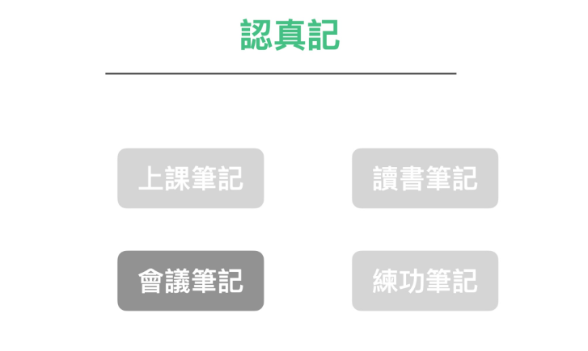

这一节我们要讨论的是会议笔记。

会议笔记，乍看比上课笔记，读书笔记棘手。

因为上课与读书的资料多数是由专业人士，经过结构化的输出排而成。会议是不特定人士的你一言，我一语的所构成，且本体又是声音。

做笔记难度看起来高出许多。但改善会议笔记的品质，不如大家原先想的那么难。

### 会议笔记的关键在于开会技巧

改善会议笔记的重点，并不在笔记技巧本身。

我们之所以觉得做会议笔记困难，是因为职场上许多人是不懂开会技巧的。

经常发生的情形是：大家在开会前，毫无准备，在讨论时也常你一言我一语的天马行空发想，拖了几个小时，最后却没有具体的决行结论。

搞得与会人苦不堪言。这样的会议到底要如何做上会议笔记呢？

我认为，要改善这件事，本质上是会议结构要进行改变。

我曾在远距工作这样做这本书：谈到如何高效开会。

### 1.  使用常态会议流程模版开会

大多数的会议，其实本身是从流程开始都乱七八糟。

不过，公司内一般常态性的会议，有其目的以及希望产出。而控制流程就可以控制一定的复杂度。

### 2. 强制要求参会者有「会议是拿来表决，不是拿来讨论」的集体共识

与会人常见的会议误区是：以为会议是拿来讨论的。

但会议要开的开效的秘诀是：在会议前，大家必须先行提供自己的看法，而会议是拿来表决的。

这一点甚至在 Amazon 这间公司是 Must Have。

### 3. 决行或甩锅

要有会议记录的原因，目的只有两个：

 * 决行
 * 或要甩锅到其他人身上。

倒推回去，你会发现一个会议会有只有四个面向需要记：

1. 会议目的
2. 会议上被提出的方案
3. 会议上表决的结果
4. 众人对方案与表决的分歧意见

当你用这个角度去开一个会议的时候，开会与纪录会议笔记自然就比较容易事半功倍。

