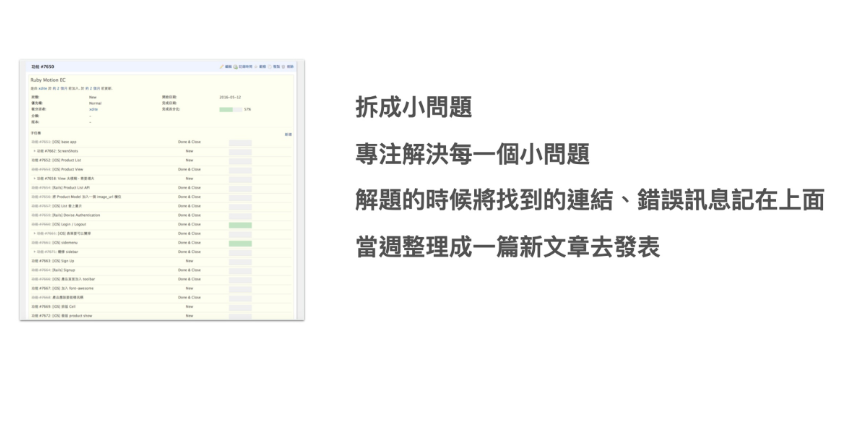

最后一种记笔记场景，是练功笔记

我们在职场上，有时候需要纪录自己上班所需场景的操作笔记。或是对于学习职场技能时，所需要记一些学习笔记。

这又该如何进行呢？

关于这个议题，我在打造超人学习的章节也略有提及，

### Step 1: 将任务先拆分成小问题

主要的流程概念是

将想要进行的任务，拆细变成清单，先变成小问题。

拆成小问题的好处是：

1. 当问题颗粒小时，容易完成，成就感较高
2. 有些问题难以解决是因为问题颗粒大以及模糊，将问题拆分，就可以把困难与未知的问题先行隔离出来。未来再进行研究实做。就不容易撞墙

再来，当我们将之拆细后，就容易绕着这个问题去搜集资讯。

### Step 2:  将搜集到的相关记录（包括错误讯息），钜细靡遗的纪录下来

在学习新技能时，我有一个特殊的习惯：将在学习过程中找到的网址都集中贴在这个任务的留言区中。

我不仅会贴正确的尝试，也会贴错误的尝试和错误讯息。

这是因为错误的尝试本身也是一种“正确”的信息。

有时候在挑战未知的领域时，我们可能会无意中踩到一些坑。如果我们没有标记出这些坑，下次我们还是会无意中踩到它们。而踩中这些坑也可能隐藏着我们某些观念不是很正确，这些坑可能也包含一些我们未来需要学习的新信息。

很多人在学习新技能时常感到苦恼，因为要记忆的线索、资料和信息实在太多太杂了，散落各处。

因此，我发明了这个方法，将学习过程中的记录全部集中，且围绕特定问题进行录制。

当将来遇到相似的问题时，我就可以打开这个记录，找到所需信息，记忆也能全部回来。

### Step 3 : 事后一定要再单独整理一篇总结

当然，「录制」只是这个方法的前半部分。

另外一个同样重要的部分是必须写总结。

在过去，当我还是程序员时，工作或学习技能时，我都使用这套方法，记录下我解决问题所找到的相关资料，然后解开问题。

通常我会在一两周内回顾之前的任务记录，并以此总结撰写一篇新的博客作为教程。这样做的好处在于，第一，可以进行复习，第二，后面写的这篇文章就是一个可以立即重复使用的“程序性SOP”或“概念教学”文章，无论是自己还是别人，都可以在未来立即使用。这样就不需要再次花费相同的时间研究问题，只需要查找并重新使用。

