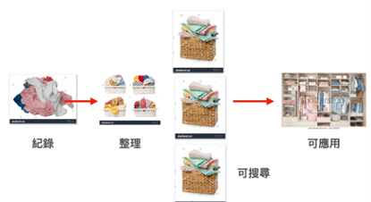

進入「整理」議題之前，在這裡，我想先談一個往往被人遺漏的環節：「提取」。「提取」其實是「整理」環節中一個相當重要的基礎。少掉這個環節，基本上會事倍功半。

因為，嚴格的來說：上一章「記錄」篇，我們所記下的東西，不叫「資訊」，甚至也不叫「資料」，只能叫「線索」。

* 資訊是有意義的輸入／輸出
* 資料是可以拿來整理刪改的材料
* 而我們記下的只能叫「線索」，通往資料的索引。

在我們模糊的感覺中，這三者非常相似。但其實在筆記這個領域中，是有巨大差別的。

過去，我們往往花了半條命，專注記回當下學到的東西，或回家整理了好一陣子。過了兩個月，再回去翻閱寫下的東西，卻什麼都不記得也沒有印象，也不能直接拿來使用。這些，不叫線索叫什麼呢？

再進一步說，「線索」還是指當下能讓你通往下一道門的材料。我們當時只是記了一些「有趣的東西」，甚至都不是一份「可以直接拿來修改使用的資料」。如果又把線索放到過期了，那就什麼也不是了。

### 將線索變成資料

在 [[02-2-隨手記　Read it Later & Do it Later]]  中我們介紹了如何快速隨手記的訣竅。並說明了第一遍摘下的筆記，其實只需保持時間戳記做為索引。

這是使用大腦的其中一個索引特性：「時間序列」作為原理。我們再將之「標準格式化」（統一轉成文字或用照片收藏），之後就容易使用電腦輔助搜尋。

這個流程叫「線索捕捉」。

不過，若這些材料後續要真正能被使用，要能夠「搜尋」、「挖掘」、「利用」，其實還需要經過進一步的加工。

讀者看到這裡，乍看之下可能會覺得有些麻煩。但其實這是必要的。不然當時記得那麼辛苦，後來卻很難被搜到，搜到以後也沒辦法用。那不是很可惜嗎？

### 如何正確整理筆記：談談如何「折衣服」

我相當喜歡用一個日常生活中的概念「折衣服」類比到筆記整理的領域上。

能夠快速找到過去的筆記，並很快的能夠重新利用。本質上極像從乾淨且排列整齊的衣櫃裡面找到想穿的衣服一樣。

我們要學的其實只是一套衣櫃收納術。

問題來了，怎麼入門？而且，雖然我們知道衣服收納的重要性，折好以後可以衣服筆挺，想要穿的時候方便取用。但是其實沒有人喜歡折衣服。

* 第一個原因：折衣服的過程實在很累。
* 第二個原因：每個人望到筆記專家的衣櫃都感到羡慕。

但看到自己堆積成山的衣服，以及面前的空衣櫃。一下就浮上超強的無力感。不知道從何下手。

### 引入流程化的概念

我曾經也是筆記苦手。也是經過長久的摸索與嘗試之後，才發現當今的筆記術，讓我們在學習時掉進了一個大坑。

簡單來說，當我們在學習筆記術時，或這些筆記術在教學時都犯了一個很嚴重的錯誤。它假設了大家的筆記**都應該從衣服堆直接放進衣櫃裡面，邊放邊整理**。

試想：每從地上拿起一件衣服，然後要憑空折好，再放進櫃子裡面。擺著擺著又看了不順眼，好像跟型錄上美美的照片，看起來很不像。於是你又把疊好的衣服換個位子，加個隔間，調來調去的。

如果我們有五十件衣服要折，如果使用這樣的流程。恐怕折到第十件時，心靈與肉體就陣亡了。

那我們應該怎樣改善這樣的折衣服效率呢？

簡單來說，我們

1.        至少要把衣服先分類，相同類型的分成一籃一籃的待折衣物
2.        然後我們再專心的把每一籃的簡單折個大概。相同款式或相同顏色的疊一起。
3.        最後在一籃一籃的收進櫃子裡面

這樣起碼是比較省力與合理的折衣服方式。

至少你懶得折又趕著穿衣服的時候，也可以直接從分好的上衣籃裡面撈衣服出來穿。

當我們把折衣服的這個概念映射到做筆記上，指的是**至少要將資料分籃整理**。

### 收納衣服第一步：分籃（資訊提取）

那麼，我們又要如何開始呢？

我們在前述講的將記下來的筆記轉成統一格式（mp3,mp4 轉成文字）。看起來在正常人很多餘。其實是必要的環節。

因為這個步驟可以讓我們的外部大腦（電腦）快速找到

其實就有點像是至少你可以直接去分類好的籃子拉衣服出來穿的意思

不僅以「日」單位可以方便查找。同時我們也可以利用現代電腦的強大，利用關鍵字快速找到我們要的資料，而且隨處可存取。

至少就達到了「方便取用」的第一步。

我自己甚至會將購買過的紙本書，電子化後，透過 Zappier 將 Dropbox 與 Notion 串接。

這樣一來，我就可以快速找到我曾經購買的書籍，並查看我對這些書籍的短評和分類。

同樣地，我也會將網上的影音課程轉換成文字檔，並進行翻譯，以便將其收藏成可搜尋的電子書。（在當今科技，這並不是昂貴不可行的科技。OpenAI 的 Whisper 與 ChatGPT API 就可以做到，而這甚至是我在 OpenAI 的服務誕生以前就利用類似科技在進行定期的資料整理）

這樣，未來在翻找相關資料時，很快就能用進行文字搜尋，而不需要逐個查找影片或視頻。
