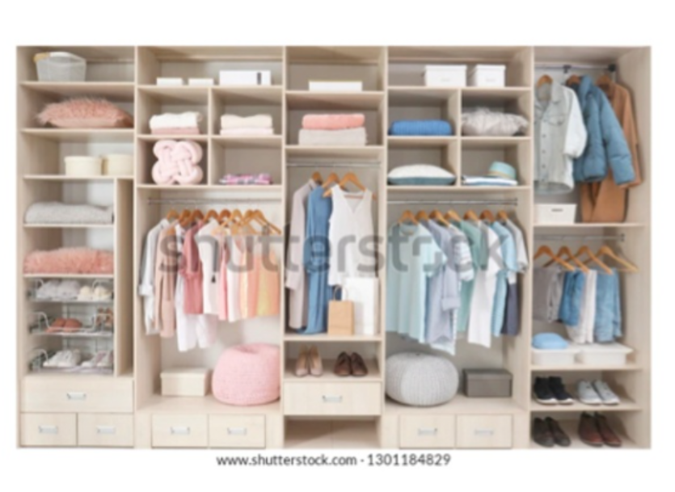
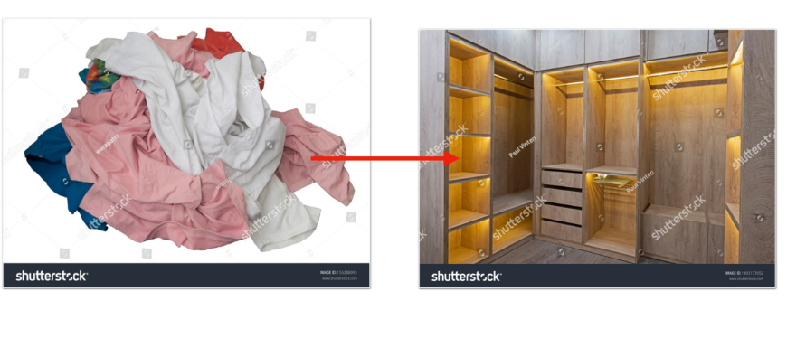
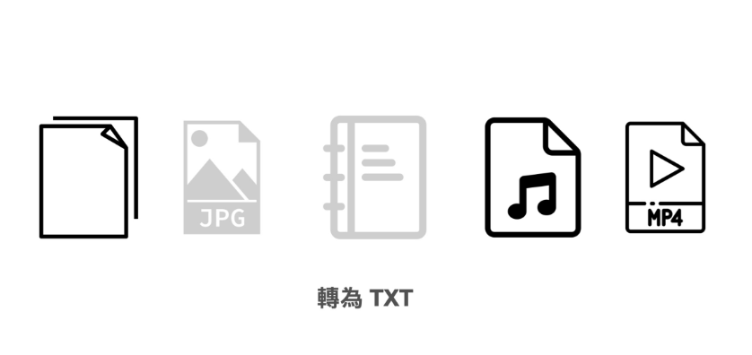
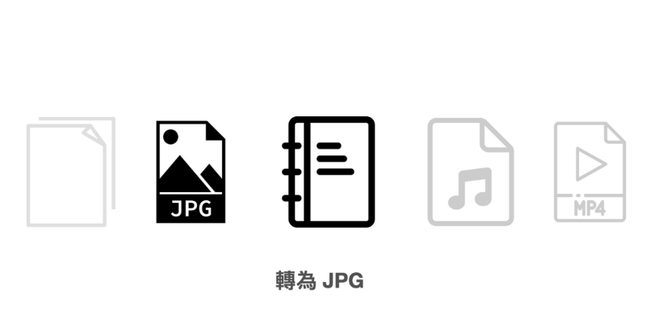
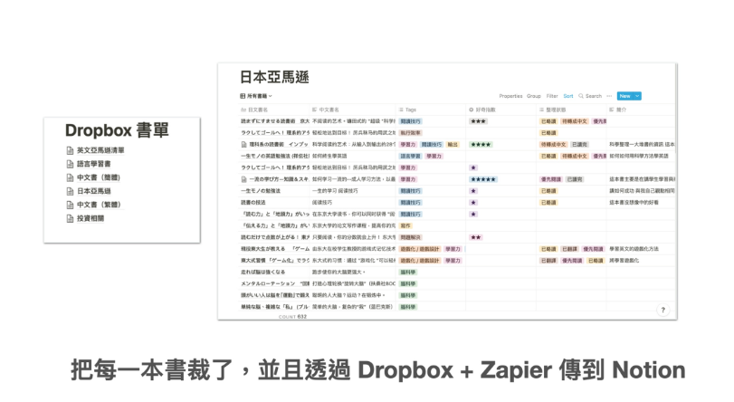

在这一章，我们并没有要一次跳入「整理」的这个环节。

因为，严格的来说，我们在上一章记下的东西，不叫「资讯」，甚至也不叫「资料」，只能叫「线索」。

因为资讯是有意义的输入/输出，资料是可以拿来整理删改的材料，而我们记下的只能叫「线索」，通往资料的索引。

这三者是有巨大差别的。过去我们往往笔记当下写了写了老半天，或整理了好一会。过了一阵子，再回去翻阅写下的东西，却什么都不记得也没有印象，也不能直接拿来使用。

所以这些写下的东西，不叫线索叫什么呢？

再进一步说，「线索」还是指当下能让你通往下一道门的材料。你当时只是记了一些「有趣的信息」，甚至都不是一份「可以直接拿来修改使用的资料」。如果又把线索放到过期了，那就什么也不是了。

### 将线索变成资料

在 [[02-2-随手记]] 中我们介绍了如何快速随手记的诀窍。并说明了第一遍记的笔记其实只需保持时间戳记。

这当中的原理是，使用大脑的其中一个索引特性：时间序列。

我们再将之「标准格式化」（统一转成文字或用照片收藏），之后就容易使用电脑辅助搜寻。

这个流程叫「线索捕捉」。

但这些材料要能够真正能被使用，要能够「搜寻」、「挖掘」、「利用」，其实还需要经过进一步的加工。

你可能会觉得有些麻烦。但其实这是必要的。不然当时记得那么辛苦，后来却很难被搜到，搜到以后也没办法用。那不是很可惜吗？

## 如何正确整理笔记 -- 谈谈如何「折衣服」

整理笔记之所以让人望之生惧，是因为在一般印象中，这个过程通常会耗费学习者比「记笔记」这件事还要巨大的能量。

所以很多人才会寻求「一边记笔记、一边整理笔记」的方法。

这也是为什么在笔记这门学问中，阵亡的比例这么高的原因：

* 在记录的道路上跑得气喘吁吁
* 在一边记录一边整理的道路上双脚打结，摔个狗吃屎
* 在整理的道路上，未战先逃

你很少听到有人能够在「整理笔记」这件事上，是越整理越开心，越有成就感的，最后衣柜甚至整理的整整齐齐，闪闪发光，听起来根本是天方夜谭的事。

但其实这样的方法不仅存在，还相当简单。

我喜欢用一个日常生活中的概念「折衣服」类比到笔记整理的领域上。

能够快速找到过去的笔记，并很快的能够重新利用。本质上极像从干净且排列整齐的衣柜里面找到想穿的衣服一样。

我们要学的其实只是一套衣柜收纳术。

问题来了，怎么入门？而且，虽然我们知道衣服收纳的重要性，折好以后可以衣服笔挺，想要穿的时候方便取用。但是其实没有人喜欢折衣服。

第一个原因是：折衣服的过程实在很累。

第二个原因是：每个人望到笔记专家的衣柜都感到羡慕。

但看到自己堆积成山的衣服，以及面前的空衣柜。

一下就浮上超强的无力感。不知道从何下手。

### 引入流程化的概念

我曾经也是笔记苦手。也是经过长久的摸索与尝试之后，才发现当今的笔记术，让我们在学习时出了什么样的误区。

简单来说，当我们在学习笔记术时，或这些笔记术在教学时都犯了一个很严重的错误。

它假设了大家的笔记都应该从衣服堆直接放进衣柜里面。边放边整理。

试想：你每从地上拿起一件衣服，然后要凭空折好，再放进柜子里面。摆着摆着又看了不顺眼，好像跟型录上美美的照片，看起来很不像。于是你又把叠好的衣服换个位子，加个隔间，调来调去的。

如果我们有五十件衣服要折，如果使用这样的流程。恐怕折到第十件时就心灵与肉体就阵亡了。

那我们应该怎样改善这样的折衣服效率呢？

简单来说，我们

1. 至少要把衣服先分类，相同类型的分成一篮一篮的待折衣物
2. 然后我们再专心的把每一篮的简单折个大概。相同款式或相同颜色的叠一起。
3. 最后在一篮一篮的收进柜子里面

这样起码是比较省力与合理的折衣服方式。

至少你懒得折又赶着穿衣服的时候，也可以直接从分好的上衣篮里面捞衣服出来穿。

我们把折衣服的这个概念映射到做笔记上时，其实就是我们至少要将资料分篮整理。

我非常喜欢折衣服这个概念是因为，在讲述笔记术时，很多人听到笔记至少要经过「纪录 -> 整理 -> 搜寻 -> 应用」，而且最好能够多次反覆的整理，下次才能很快找到的找到笔记，且找到了笔记之后也能很高效的重新利用。

..........后，就谢谢再联络了。

但是如果我们用折衣服与折衣服的流程这个概念去比喻，却又变得不是那么难，且看起来相当合理。

### 第一步：分篮

那么，我们又要如何开始呢？

我们在前述讲的将记下来的笔记转成统一格式（mp3,mp4 转成文字）。看起来在正常人很多馀。

其实是必要的环节。

因为这个步骤可以让大脑快速找到

其实就有点像是至少你可以直接去分类好的篮子拉衣服出来穿的意思

不仅以「日」单位可以方便查找。同时我们也可以利用现代电脑的强大，利用关键字快速找到我们要的资料，而且随处可存取。

至少就达到了「方便取用」的第一步。

在打造超人学习中，我就有介绍类似的手法了，我会将购买过的纸本书，电子化后，透过 Zappier 将 Dropbox 与 Notion 串接。

如此一来，我就可以快速找到我曾经购买的书，以及对于该本书我曾经的短评与分类。

而我也会把网路上上过的影音课程，转成文字档（且翻译）收藏成可搜寻的电子书。

这样，我在想要时就能相对比较快速的挖到我想要找的资料。
