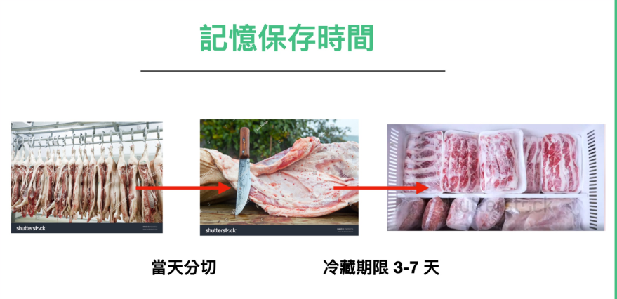

下一节，我们会介绍如何进行第二步，也就是如何细折分类篮的衣服。

### 做出一份日后可以理解回顾的笔记

乍一看，读者会很不解，为什么做一份笔记要那么多工序？

旧式抄笔记流程，不就是抄 -> 找，就收工完事了吗？现在为什么要多搞那么多事

旧式抄笔记法，最后的问题还不是找不到，而是回去后看不懂自己当初再抄什么，无法理解。

那，有没有什么笔记法，是让我们抄下来回去自动理解的笔记法呢？

有，就是这套看起来有点复杂的整理方法。怎么说呢？

这要谈到人类是如何理解一件新事物的。

人类周遭的世界，几乎每个领域每件事物，都是由多个元素所构成。

所谓，「理解」在大脑中的作用机制，是先回去大脑里挖掘有没有「元素」或「结构」相似的过去记忆，再试着与现有经验结合匹配运行看看。

当我们在脑袋里面找不到类似的匹配物时，大脑会说「我不理解」。

大部分时候，我们之所以不理解一件新领域的事物，绝大多半的原因是「元素」是新的，或「结构」是新的。

而教学上的譬喻是对于「理解」这件事是极其有用的。因为譬喻往往是等于将眼前这件事物用你过去记忆曾出现的结构重新表示。

就如同我们正在举的这个「笔记」折衣服的例子，对于「整理笔记」这件事，我们往往会觉得很麻烦也无从下手。

但以折衣服这件事的结构去譬喻，突然间这问题就好像被解成大半了。看起来也没有那么困难了。

所谓大脑是否理解，只看这两件事是否成立

* 元素一致性
* 结构一致性

这就是为什么我们在学习过后，捕捉一大堆资料之后，必须要进行适当整理或重构。因为没有经过这样分解，大脑是无法消化、无法理解的。

### 学习就像是打猎

我再以另外一个打猎的例子解释「资讯消化」的重要性。
 
我们可以把上课想像成是去野外里猎野味，野外虽然有很多动物，但实际上要真的捕捉一支野猪或野兔真的是相当费劲的。

再来，就算我们真在外面打到一支野猪，也不可能直接生啃吧。

总得将野猪放血、拔毛、剁块。

* 放血、拔毛，你可以想像是「笔记处理」。
* 剁大块是「简单分类」。

起码我们要剁快、切片，才能煮来吃嘛！

而我们吃肉的方式，多半也是肉片、肉丝，绞肉。很难是直接啃一支猪腿或啃一颗猪头对吧？

而且呢，如果这些肉吃不完，我们也要加工处理，记忆就跟肉类一样有保存期限。要是你不在杀猪之后的几天之内处理冰存，肉就会烂光光不能吃。

这样一解释，各位读者还觉得边纪录边整理，然后立刻可以拿来复习，之后也迅速可以拿出来复用。是很合理的一件事吗？

简直是天方夜谭嘛！

這就是為什麼我們在這堂課裡面說，要做好筆記，必須經過：

> 纪录 -> 整理 -> 搜寻（取用）-> 应用

這一道過程。

對應的就是

> 打獵 -> 整理 -> 切片 -> 下廚

