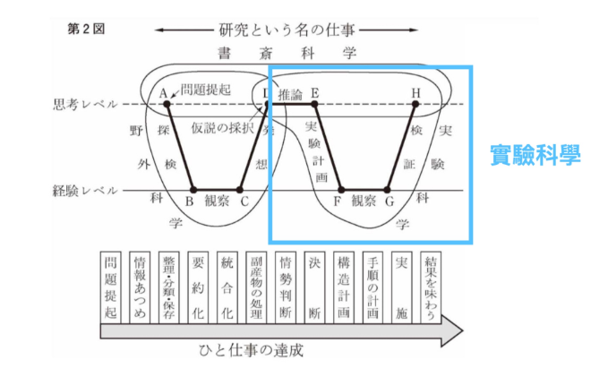
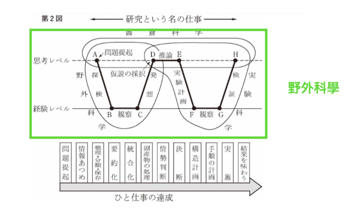
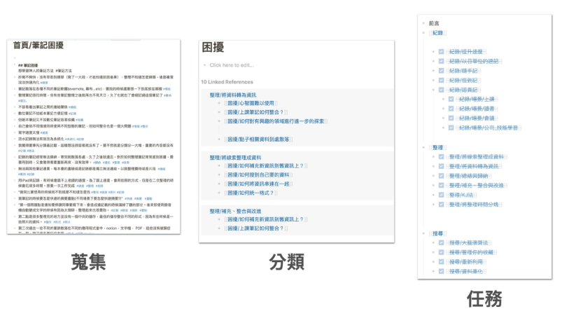

打造超人笔记这本书，结构与内容上都会比前几本作品更来的轻与精炼。

主要是笔记这个看起来复杂的议题，其实远比学习与读书这两个问题来的简单。

拆开流程以后，主问题结构变得非常简单。

甚至笔记这个领域最大的难题「快速记录工具」、「笔记整理软体」，到了 2020 后，许多外星科技陆续的被发明出来。

经过上一章我的拆解示范之后，各位读者甚至会有种「什么，这问题就这么简单，我怎么当初会被困扰这么久」的错愕感。

有了这些工具，甚至在一般的情况，「笔记搜寻」这件事，都是个小事。

只要读者按照 [[03-提取-将线索变成资料]] 提及的方法，将线索经过

* 格式处理（转换成手机、电脑容易搜寻）
* 档案是使用日期序列方式排列
* 档案使用关键字连结
* 储放在云端服务上（如 Dropbox, Evernote）

几乎不存在打捞不回来的状况。

所以在本书里面的「搜寻」这一章，我想探讨一个超级难度的「搜寻」问题：如何透过做笔记、整理笔记，来挖掘整理出自己对一个领域想要的各种答案。

各位看完这段内容的拆解与示范，你也可以回家做到类似的成就！

## 做研究最难的问题：如何定义问题且找到方向与答案

在一般情况，我们做笔记，面对的都是纪录已知的资讯，然后试着去整理出一些在结构上我们能够理解的资讯去做内化。

但有时候，我们在做研究时，有时候想要研究的难题，我们甚至不知道如何定义问题。所以根本不知道怎么样找资料！

书读了一大堆，怎么样画线，也从过去的资料里面找不到符合的答案。这种状况很是令人困扰。

比如说：甚至就像本书的主题：如何做笔记、能够又轻松又省力、随时可以找到过去记录的东西，看到旧笔记时时能够轻松理解，而且想要取用时就可以立刻混搭应用。

这个难题本身就可以算世界难题了吧？当初我在做本书前身读书会的内容时，每个人都觉得这个题目是不可能被解掉的阿！

但是经过上一章的示范。我相信各位看到一定下巴掉下来，这个问题的答案怎么这么简单。原来这么难的问题，只要做几轮干坤大挪移，就解决了。简单到令人震惊，这是怎么做到了？

## 对问题的结构重新组织

在研究上我认为绝大多数人类都有一个误区：就是认为所有问题的答案，在书上都有答案。只要够勤奋，答案一定就在那里等待被挖掘。

这个答案可谓正确也不正确。

正确的是，历史上，绝大多数的经验很多都有被保存下来。
不正确的是，我们要寻求答案的领域里，这件事的经验甚至还未被解开过，所以自然也没有答案。

过去，我对这个难题的解决方法，是发明了一个所谓的逆向法（详见打造超人大脑与打造超人思维）：先设定目标，再从各个散落的抱怨，逆向找出真正的节点，一一的克服难题，再重新整理出一套更高效的解题顺序的顺序。

会用这个方法的原因，是透过这个方式，捕捉我想达成目标中间所有飘忽的阻碍，转化定义成一道道结构相对明确的问题分子。

透过粗的分类，与问题细节拆分，将单一大问题拆到足够细的小问题，细到足以进行类比，在一般领域能够找到相似但明确的答案。再透过排列组合，找到更有效率的执行路径，发明出新答案。

这套方法是我自己过去在无数的专案执行以及知识粹练的过程中，逐渐归纳出来的。

### 田野调查高效笔记法 - KJ 法

但这套方法，也因为我是无师自通的，我也不知道如何改进的更有效率。我十分希望过去已有先进，发明过类似的方法，这样我就可以加以参考并且修正。

过去数年，我用类似的关键字在 Amazon 上找寻，都一无所获。直到去年，我在研究知识产出议题时，才找到一个类似的方法：--- 田野调查学家「川喜田二郎」在 1967 年提出的「KJ法」（使用他的姓名缩写而成），极似这套逆向法。

这套 KJ 法的解题顺序，也是

* 首先提出许多问题
* 将问题分类
* 将问题各个击破，挖掘到最后找到问题的根本解答。

而当时，川喜田二郎为什么当初要提出这套做学问的方法呢？

### 书斋科学、实验科学、田野科学

川喜田二郎提出这样一个观点：他认为这世界上所谓的「科学」，实质上还更细分为三种科学。

* 书斋科学
* 实验科学
* 田野科学

什么是书斋科学呢？

我们学校见到的那些学问。很大一部分，是所谓的学者，读书「整理」出来的。

但是这些学问并没有经过验证，只是自己发起一个问题，然后到书中粗暴的找到一还 OK 的主观答案，最后组织而成的读书笔记。

这些学问看似好像很有道理，但当中多数无法经过推敲。

（这也是有些学问看着好像正确，但实际上又很像通灵的缘故。书斋科学也是当今学术界有些理论根本经不起推敲与重现的缘故。）

直接「问题提起」，就看书「推论」下去了。

### 实验科学

而实验科学，就是我们在实验室里面见到的那些科学。可重复，可证伪。

但实验科学开始的节点是「一个推论」。由一个推论开始在无污染的实验室中进行。最后虽然得到一个在实验室可验证的结果。

但回放到原始的领域，这些实验最后的结果，却无法重现。或只能部分重现。

或者是无法解释原先领域的真正问题。

### 田野问题

而川喜田二郎所在的领域是社会科学。社会科学的特点是

* 通常没有前书可以推论
* 也很难在实验室里面重现结果（因为没有办法创造出无尘环境）

而这门科学最困难的甚至是，如何定义最初的问题？

其实不只是社会科学。世界上大多数的领域，其实都面临着这样的挑战？

* 什么才是真正的问题？
* 我们又如何挖掘出真正的关键并解决
* 并且把关键点解开重新排序成为真正的概念方法
* 这些概念与方法还要是可重复可证伪且放诸四海皆准的

于是他才提出这样的解题方法

先大量搜集资讯以及目前环境中浮现的问题，用索引卡片搜集起来，经过一定的整理、分类，对卡片上的问题，找到合理的流程与公式，最后一个一个攻破，找到更高效的答案后，整合在一起。

经过大量的淘洗之后，这样产出的最终结论甚至会颠覆原有领域直觉的答案。

我相信，在阅读打造超人笔记这本书之前，我想很多读者，可能一辈子都想象不到笔记是可以这样整理的，也必须这样整理：

* 原来我们大脑的原始设计，无论如何是无法应付一边纪录一边整理的。
* 原来我们花上许多功夫整理的笔记，很多时候，根本只是没有办法重新再利用的线索。
* 而我们每次整理笔记，从入门到放弃，是因为我们先归纳再总结，而不是先总结再归纳

## 透过逆向法 + 问题节点，重新归纳类比，破解笔记难题

看到这里，各位读者应该会知道，这本书的内容是怎么粹练出来的。

我正是用用这套方法 + 卡片笔记法 + 笔记软体 Logseq 做出来的。

当时，我原本开读书会的初衷，是想要分享 Logseq 这套软体如何使用的。于是做了一个读书会的问卷调查表单，结果没想到想参加的人，关于读书会的问题，全部都不是关于工具上的，而是对笔记这门学问，真真确确存在很多基础却也相当严重的入门即绊倒的难题。

于是收到这一百多个问题后，我就先将这些问题，一条一条贴进笔记软体内，然后再为它们打上 TAG。经过打了一两轮 TAG 后，我发现这些问题，主要具拢在五大难题上：

* 纪录
* 提取
* 整理
* 搜寻
* 应用

在这五个类别下，有各自大概十数条难题。有些难题是我曾解过的，有些则是我没碰过但稍微搜寻一下，可能当今世界上答案已经存在的。

但一一耐心将这些问题都回完，我发现笔记世界里面 90%的问题差不多被我破完了.....

不仅如此，为了整理读书会的投影，我为了转述比喻一些形象的概念，做着做着竟然也整理出连我自己也感觉经典的「总结与归纳」、「打猎切肉」的神奇误区厘清观点。

如果读者本身是研究者，若你要进行一项新领域的挑战，或者要展开一项新领域、兴趣的挑战，不妨用这个方法流程挑战尝试看看。极有可能会产出令人惊喜的结果。
